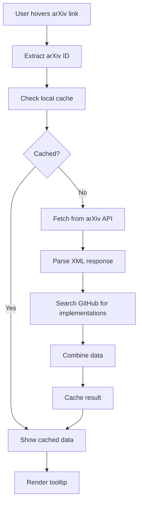

# 🚀 arXiv Abstract Hover

[](https://chrome.google.com/webstore/detail/arxiv-abstract-hover/...)
[](https://github.com/your-repo/arxiv-hover-plugin)
[](LICENSE)
[](https://github.com/your-repo/arxiv-hover-plugin)

> **Instantly preview arXiv papers without leaving the page!** Hover over any arXiv link to see abstracts, authors, categories, and GitHub implementations in a sleek, dark-themed tooltip.

## 📌 Visual Assets

### ✨ Youtube Video Link : https://youtu.be/4L020MPAjl0 ✨

> Demo Video below 

https://github.com/user-attachments/assets/1c5794cc-b14a-475a-ab2b-192ba7985d36


## ✨ What's Novel & Useful

### 🔍 **Zero-Click Paper Discovery**
- **Instant Previews**: Hover for 300ms over any arXiv link on the web — abstracts appear instantly
- **No Page Navigation**: Stay in your current workflow; no need to open new tabs or visit arXiv.org
- **Universal Compatibility**: Works on Reddit, Twitter, academic sites, blogs, forums — anywhere arXiv links exist

### 🧠 **Smart GitHub Integration**
- **Implementation Discovery**: Automatically finds related GitHub repositories using paper titles
- **Quality Filtering**: Shows top-starred repos with descriptions and programming languages
- **Fallback Intelligence**: Links to PapersWithCode when no direct implementations found

### ⚡ **Production-Grade Performance**
- **Intelligent Caching**: Fetches once, remembers forever (per session)
- **Background Processing**: Non-blocking API calls via Chrome service worker
- **Error Resilience**: Graceful degradation with loading states and error messages

### 🎨 **Beautiful UX Design**
- **Dark Theme**: Eye-friendly design with arXiv-inspired orange accents
- **Responsive Positioning**: Smart tooltip placement that stays in viewport
- **Smooth Animations**: Subtle transitions and hover effects

## 🛠️ How It Works



### Technical Architecture

- **Content Script** (`content.js`): Handles DOM events, tooltip positioning, and user interactions
- **Service Worker** (`background.js`): Manages API calls to arXiv and GitHub, implements caching
- **Manifest V3**: Modern Chrome extension architecture with proper permissions
- **XML Parsing**: Custom regex-based parser for arXiv's Atom feed (no DOM in service workers)

## 🚀 Installation

### From Chrome Web Store
1. Visit [Chrome Web Store Link](https://chrome.google.com/webstore/detail/arxiv-abstract-hover/...)
2. Click "Add to Chrome"
3. Done! Works immediately on all websites

### Manual Installation (Development)
```bash
# Clone the repository
git clone https://github.com/your-repo/arxiv-hover-plugin.git
cd arxiv-hover-plugin

# Load in Chrome
1. Open chrome://extensions/
2. Enable "Developer mode"
3. Click "Load unpacked"
4. Select the arxiv-hover-plugin folder
```

## 📋 Requirements

- **Chrome**: Version 88+ (Manifest V3 support)
- **Permissions**: 
  - `scripting`: For content script injection
  - `host_permissions`: arXiv API and GitHub API access
- **APIs**: No API keys required — uses public arXiv and GitHub APIs

## 🔧 Technical Details

### API Endpoints

```javascript
// arXiv Paper Data
GET https://export.arxiv.org/api/query?id_list={ID}&max_results=1

// GitHub Repository Search
GET https://api.github.com/search/repositories?q={TITLE}&sort=stars&order=desc&per_page=5
```

### Data Flow

1. **Link Detection**: Regex matches arXiv URLs (`arxiv.org/abs|pdf|html/...`)
2. **ID Extraction**: Supports both new (`1706.03762`) and old (`cs.CL/9901001`) formats
3. **API Fetching**: Parallel requests to arXiv and GitHub APIs
4. **Data Processing**: XML parsing, HTML entity decoding, data normalization
5. **UI Rendering**: Dynamic tooltip creation with smooth animations

### Performance Optimizations

- **Debounced Hovering**: 300ms delay prevents accidental triggers
- **Memory Caching**: In-memory cache prevents duplicate API calls
- **Lazy Loading**: Tooltip created only on first hover
- **Efficient Parsing**: Regex-based XML extraction (no heavy DOM parsing)

### Security Considerations

- **CSP Compliant**: No inline scripts or eval usage
- **Permission Minimal**: Only required permissions for functionality
- **Data Sanitization**: HTML entity decoding and text sanitization
- **Rate Limiting**: Respects API limits with caching strategy

## 🎯 Usage Examples

### Academic Browsing
```html
<!-- On any webpage -->
<a href="https://arxiv.org/abs/1706.03762">Attention Is All You Need</a>

<!-- Hover shows: -->
<!-- - Full abstract -->
<!-- - Authors: Vaswani et al. -->
<!-- - Categories: cs.CL, cs.LG -->
<!-- - GitHub repos: pytorch/fairseq, huggingface/transformers -->
```

### Social Media Integration
- Reddit threads about ML papers
- Twitter discussions with arXiv links
- Academic blogs and newsletters

## 🧪 Development

### Project Structure
```
arxiv-hover-plugin/
├── manifest.json      # Extension manifest
├── background.js      # Service worker for API calls
├── content.js         # Content script for tooltip logic
├── popup.html         # Extension popup interface
├── tooltip.css        # Tooltip styling
└── icons/            # Extension icons (16x16, 48x48, 128x128)
```

### Building & Testing

```bash
# Run tests (if implemented)
npm test

# Lint code
npm run lint

# Build for production
npm run build
```

### Debugging

1. Open `chrome://extensions/`
2. Enable "Developer mode"
3. Click "Inspect views: background page" for service worker logs
4. Use browser dev tools on target pages for content script debugging

*Transforming how we discover and explore scientific literature, one hover at a time.*</content>
